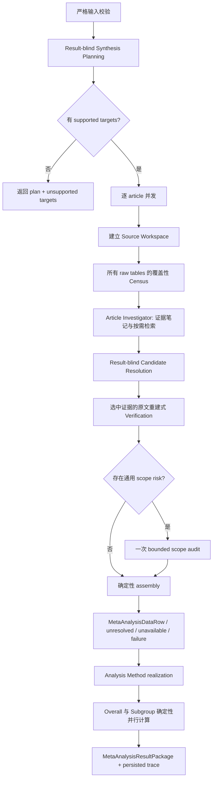

# Meta-analysis 自动化 Evidence Agent 解决方案

> 状态：`source_workspace_agent_v16_direction_adjudication` 已接入 production factory；旧 executor 不再通过维护 factory 暴露
>
> 日期：2026-07-20
>
> 适用范围：Online EBM workflow 中已通过 Screening 的个体随机、平行组 RCT；pairwise 二分类与连续型结局
>
> 非目标：重新 Screening、Risk of Bias、GRADE、network meta-analysis、由 LLM 执行统计计算

## 1. 摘要与设计结论

本模块不应实现成“把整篇文章交给一个模型，让它一次完成 Meta-analysis”，也不应继续扩展成一个由大量固定
LLM 步骤、候选标签和例外规则组成的流水线。

建议采用**确定性外壳 + 有界文章证据 Agent**的混合架构：

- application 固定编排 Synthesis Planning、逐篇研究证据处理、统计方法实现、亚组分析和总体估计；
- LLM 模拟系统综述专家，负责预先规划中的临床语义，以及文章内证据定位、表格理解、跨来源关系判断和真正的
  语义歧义；
- Evidence Agent 使用文章工作区按需搜索、读取和重新读取原始 source，不把完整长文章或完整历史持续塞入上下文；
- 预算内每张原始表格必须进入覆盖性检查，caption 和 section title 只作为提示，不能作为是否读取的门禁；超出
  table/window 预算时必须显式标记 incomplete coverage；
- 最终结果选择遵守冻结且与结果大小无关的 selection policy；
- 代码负责 ID、hash、缓存、schema、来源核对、数值约束、允许的统计转换、多臂合并和全部 Meta-analysis 算术；
- 先让原文验证器选择证据支持最强的解释；只有没有可辩护候选或候选确实无法区分时，才触发一次具体冲突裁决并保留
  `unresolved`；
- LLM/provider 失败与文章证据不足分开表示，retry 固定为首次调用加一次 retry。

这不是完全自由的 Agent，也不是完全固定的工作流。Agent 只放在固定规则最难覆盖、且确实需要专家语义判断的
Study Evidence 边界；其余阶段保持确定性、可复现和可测试。

## 2. 为什么需要重新设计

### 2.1 当前任务本身的难点

- 一篇文章可能很长，正文、表格、脚注和补充材料较多；结果所在位置并不稳定。
- 表格 caption、标题、表头或 section title 可能为空、过短或没有信息量。
- 原始表格存在多层表头、合并单元格、脚注、缩写和不稳定 XML 结构，确定性清洗容易改变原始语义。
- 一个可分析结果可能分散在结果表、基线表、participant flow 和正文中。
- 同一结局可能有多个量表、时间点、分析人群、亚组、endpoint/change、adjusted/unadjusted 版本。
- 一个 N 可能表示 randomized、baseline、analyzed、outcome-complete 或某个局部结果的 denominator。
- 表头通用 N、单元格脚注 N 和正文中的样本量可能同时存在；没有一种来源具有普遍优先级。
- Review target 往往比 article-local result 更宽，不能直接用 target 的粒度覆盖文章事实。
- 多臂研究需要判断哪些臂符合 comparison，以及如何避免遗漏相关臂或重复计算共享对照。
- 文章可能只报告 percentage、non-events、variance、SE、CI、P value 或直接 effect estimate。
- 只有在语义作用域已经确认后，部分字段才允许由版本化公式确定性推导。

### 2.2 当前 Agent/工程难点

- 大上下文的“可容纳”不等于“可可靠使用”。重要信息位于长上下文中部时，模型可能漏读或错误关联。
- append-only 对话会不断加入旧 source、工具输出和中间推理，造成 context pollution。
- 过早把原文压缩成摘要、candidate ID 或 material ID，会使后续裁决器看不到真正需要判断的证据。
- 摘要可以帮助定位，但本身也可能遗漏脚注、作用域或 competing evidence，不能成为最终证据。
- 如果按 target × table 分别调用，调用量随 target 和表格数量相乘。
- 如果每次都重新传全文，输入 token、延迟和 provider 失败概率都会快速增长。
- 多个相同模型做相同任务并投票，并不等价于两个独立的人类审阅者；稳定模型可能稳定地产生同一系统性错误。
- 只让 verifier 从既有 ID 中选择，无法纠正第一阶段从未创建或错误表达的证据。
- 无界 recovery、并发和 retry 会形成调用风暴；过紧的固定轮数又可能把未完成覆盖误报成“无数据”。
- 文章表格必须保留原始 XML；如果只依赖清洗后的行列结构，表头、脚注和跨行列关系会在进入 Agent 前丢失。
- 当前 module API 对 `articles` 使用宽泛的 `dict` 列表，嵌套文章结构的校验强度不足。

### 2.3 仓库数据规模给出的工程信号

对当前 filtered benchmark 的 437 篇文章做只读规模审计可见：正文字符数中位数约 2.6 万、P90 约 4 万；表格数
中位数为 3、P90 为 5、最大为 12；同时存在超过 100 万甚至 500 万字符的 proceedings/container article。
这些数值只用于工程容量诊断，不作为业务规则或 benchmark 拟合依据。它说明：

- 大多数普通文章可以用少量 bounded source bundles 处理；
- 极端文章绝不能直接进入一次完整上下文；
- 应按 token 和 source coverage 管理输入，而不是仅按“文章数”或字符数管理；
- container article 需要先定位与当前研究对应的局部 report，或明确报告 source scope 无法确认。

## 3. 方法学依据及其工程含义

### 3.1 Result-blind planning

Cochrane 要求预先定义 outcome measure、timepoint 和一项研究内存在多种结果时的选择办法，并且选择不应被
观察到的效应大小影响。一个 outcome domain 在同一研究内存在多个量表、时间点或分析版本时，应使用预先规定的
规则选择一个贡献，或采用能够处理依赖性的统计方法。

工程含义：

- `synthesis_plan` 在读取纳入文章结果前形成并冻结；
- plan 可以由 LLM 模拟 protocol 专家生成，但输入只能是问题、PICO 和 screening criteria；
- 每个 target 必须包含 outcome/measure、timepoint rule、analysis population priority、result frame priority、
  data type、effect measure 和 model assumption；
- 缺乏依据时可以使用有 rationale 的 clinical convention，不能根据已看到的文章“倒推最容易合并的 target”；
- 最终候选选择阶段不得根据 effect direction、effect magnitude、CI 或 P value 选结果。

参考：[Cochrane Handbook Chapter 3](https://www.cochrane.org/authors/handbooks-and-manuals/handbook/current/chapter-03)、
[Chapter 9](https://www.cochrane.org/authors/handbooks-and-manuals/handbook/current/chapter-09)。

### 3.2 按原报告形式采集，再独立转换

Cochrane 建议使用结构化数据采集表，保留原始报告形式、原文依据和来源位置，在后续步骤再转换为统一的分析格式。
正文搜索可以辅助定位，但不能替代阅读报告。对 outcome data 的人工规范是独立双人抽取与预先规定的分歧解决流程。

工程含义：

- LLM 首先记录文章真正报告的 typed materials，而不是直接猜最终 `events/N` 或 `mean/SD/N`；
- 每个重要语义判断和数值都有原始 source ref、source hash 和可复核 source span；
- 原始提取、最终共识和推导结果分层保存；
- 自动系统无法声称与两个独立人类完全等价，因此采用“证据发现 → 结果盲选择 → 原文重建式复核 → 冲突裁决”的
  互补检查，而不是相同模型重复投票；
- 只有没有可辩护候选或完整证据下确实无法区分的分歧才留为 `unresolved`；有依据但范围不完整的最佳数保留，并在
  `scope_assessment` 中标记 warning，同时保持既有 `ready_for_estimate` disposition 兼容下游。

参考：[Cochrane Handbook Chapter 5](https://www.cochrane.org/authors/handbooks-and-manuals/handbook/current/chapter-05)。

### 3.3 统计边界

Cochrane 对常见 outcome data type、effect measure、arm-level data、直接 effect estimate、多臂研究和统计转换有
明确区分。对普通平行组 RCT，优先保留各臂 summary data；多臂处理必须避免任意遗漏相关臂或重复使用参与者。

工程含义：

- 当前收敛范围继续限定为 pairwise arm-level binary/continuous；
- 二分类输出 events/N，连续型输出 mean/SD/N；
- LLM 只判断材料的语义类型与作用域，不执行公式；
- 公式必须来自 versioned deterministic calculators；
- 分析方法不能根据 heterogeneity test 事后切换固定/随机模型；
- time-to-event、rate/count、ordinal、adjusted-contrast-only、cluster/crossover 等继续明确为 unsupported。

参考：[Cochrane Handbook Chapter 6](https://www.cochrane.org/authors/handbooks-and-manuals/handbook/current/chapter-06)、
[Chapter 10](https://www.cochrane.org/authors/handbooks-and-manuals/handbook/current/chapter-10)。

## 4. Agent 与长上下文调研结论

### 4.1 不采用“默认全文一次输入”

`Lost in the Middle` 表明，长上下文模型对相关信息的位置仍敏感，信息在上下文中部时性能可能明显下降；更长的
上下文容量不能证明模型会稳健使用其中全部内容。

Anthropic 对 context engineering 的公开建议是：把 context 当作有限注意力预算，寻找最小但高信号的 token
集合；使用 just-in-time retrieval、progressive disclosure、structured note-taking 和 compaction，而不是持续
堆积原始工具输出。Claude Code 公开采用文件/查询工具按需加载数据，而不是把大型数据对象完整放入上下文。

OpenAI 对 Codex 的公开实现也显示：Codex 通过工具收集上下文、保留环境中的 system of record，并在历史增长后
compact conversation。OpenAI 将经验概括为“给地图，而不是一份 1000 页说明书”。

因此，全文 one-shot 只保留为评估基线，不作为 production 默认路径。

参考：

- [Lost in the Middle](https://arxiv.org/abs/2307.03172)
- [Anthropic: Effective context engineering for AI agents](https://www.anthropic.com/engineering/effective-context-engineering-for-ai-agents)
- [OpenAI: Unrolling the Codex agent loop](https://openai.com/index/unrolling-the-codex-agent-loop/)
- [OpenAI: Harness engineering](https://openai.com/index/harness-engineering/)

### 4.2 不采用普通 Top-K RAG 作为唯一证据入口

普通 chunk retrieval 可能切断表头、脚注、arm、timepoint 和分析人群之间的关系。Anthropic 的 Contextual
Retrieval 也指出，传统切块容易破坏上下文，通用文档摘要或 summary-based indexing 的收益有限。

本方案中的检索只负责**发现下一步应该读取什么**，不负责证明最终字段：

- 所有原始表格都必须经过覆盖性读取；
- section 检索返回带上下文的 source reference 和原文 snippet；
- 最终字段必须重新读取其原始 table/section，而不能仅引用检索摘要；
- source observation 是导航索引，不是真值数据库。

参考：[Anthropic: Contextual Retrieval](https://www.anthropic.com/engineering/contextual-retrieval)。

### 4.3 不采用复杂多 Agent 作为默认架构

Anthropic 和 OpenAI 都建议先使用简单、可组合的结构，并在确有失败类型时才增加 Agent 复杂度。多 Agent 会增加
调用、状态同步和调试成本。当前任务真正需要动态决策的是“接下来应该读哪一块证据”，而不是每个业务阶段都需要
自由 Agent。

本方案默认只有一个 article investigator。Table census 是可并行的聚焦 LLM task，result-blind resolver 和
evidence verifier 是职责不同的有界调用，不是多个同级 Agent 投票。只有检测到具体作用域风险时，才增加一次 bounded
`scope_audit`；它可以处理冲突，也可以检查模型过度自信但未完整绑定 header/cell/footnote 的情况。

参考：[Anthropic: Building effective agents](https://www.anthropic.com/engineering/building-effective-agents)、
[OpenAI: A practical guide to building agents](https://openai.com/business/guides-and-resources/a-practical-guide-to-building-ai-agents/)。

### 4.4 临床证据自动抽取研究的启示

TrialMind 将结果抽取拆成相关内容定位、数值抽取和程序化标准化，优于简单全文 prompting；但其结果字段仍明显比
研究设计字段困难，并依赖人工检查。针对 RCT 数值结果的研究也发现，二分类结果更接近可用，而复杂 outcome 和需要
推理的数值仍是主要弱点。

本方案采用它们有实际价值的部分：先定位、保留来源、再标准化；不采用让模型动态生成任意计算代码，也不把论文中的
human-in-the-loop 性能直接外推为全自动性能。

参考：

- [TrialMind / npj Digital Medicine](https://www.nature.com/articles/s41746-025-01840-7)
- [Automatically Extracting Numerical Results from RCTs with LLMs](https://arxiv.org/abs/2405.01686)

## 5. 重新定义后的任务

### 5.1 任务定义

根据一个在结果读取前冻结的系统综述 synthesis plan，对已经通过 Screening 的 RCT article 进行可审计的研究结果
证据调查：

1. 找回文章中与每个 synthesis target 可能相关的 article-local result；
2. 保留文章实际报告的结果粒度、全部合理候选和原始 numeric materials；
3. 按冻结 selection policy 判断每项研究能否为 target 提供唯一且可辩护的 contribution；
4. 对可用 contribution 生成标准化的 arm-level binary/continuous data row；
5. 使用版本化确定性统计方法计算单研究 effect、subgroup 和 overall estimates；
6. 对没有数据、证据歧义、当前方法不支持和技术失败分别给出状态与可审计依据。

### 5.2 业务粒度

- 一个 Meta-analysis run 对应一个 `review_id`；
- planning 粒度是 review；
- Study Evidence 粒度是 `one included study/article × all frozen targets`；
- 当前业务假设仍是一个 Study 对应一篇纳入 RCT article；
- 每个 study 对每个 target 最多形成一个正式 contribution，但候选层可以保留多个 article-local results；
- 统计粒度是一个 `AnalysisSetting` 下的一组 resolved `MetaAnalysisDataRow`。

### 5.3 非目标

- 不重新判断文章是否应被 Screening 纳入；
- 不把 Study PIO 或 RoB 当作 article result extraction 的事实来源；
- 不由 Meta-analysis 判断 Risk of Bias 或 GRADE；
- 不通过 benchmark gold、row index 或已知答案指导 extraction；
- 不要求为了产生结果而强制消解真正的文章歧义；
- 不支持当前 statistical policy 之外的 trial design 和 data type。

## 6. 输入契约

### 6.1 对外输入

| 字段 | 作用 | 使用边界 |
| --- | --- | --- |
| `review_id` | 稳定任务标识、plan/cache/trace namespace | 不承载临床语义 |
| `question_text` | 原始系统综述问题 | 仅供 planning 与解释 target scope |
| `question_pico` | Review-level P/I/C/O | 是 target 边界，不得抄成 article-local fact |
| `screening_criteria` | 冻结纳排标准 | 只供 result-blind planning 理解 review scope，不重新 screening |
| `included_studies` | 已纳入 study IDs 和确定性输出顺序 | 不得重复，必须与 articles 一一对应 |
| `articles` | 每篇研究的 metadata、sections、raw table XML 和来源标识 | 是 Study Evidence 的唯一文章证据输入 |

### 6.2 `articles` 需要成为严格结构

每篇 article 至少包含：

- `study_id`；
- metadata：title、PMID/PMCID/DOI、publication year、source type；
- sections：稳定 `section_id`、可空 `title`、原始正文 text、可选 section path；
- tables：稳定 `table_id`、可空 caption、**正式字段 `raw_xml`**、可选 section path；
- article/source hash，用于缓存失效和审计；
- 原始 retrieval provenance。

`ArticleTable.raw_xml` 现在是正式字段；`rows[*]._raw_xml` 仅作为旧缓存/旧文章的兼容回退。后续可将 module API 的
nested article schema 收紧为严格 Pydantic schema，但不能用确定性 table parser 替代原始 XML 的模型阅读。

### 6.3 输入门禁

在任何 LLM 调用前由代码检查：

- `included_studies` 唯一且与 article 的 `study_id` 严格一一对应；
- article 至少有一个非空 section 或 raw table；
- source IDs 在 article 内唯一；
- raw source 可以生成稳定 hash；
- plan 输入不得混入 article results、Study PIO、RoB、benchmark annotations 或既有 pooled result；
- 单一原始 source 超出模型 transport budget 时，必须进入 source paging 或显式 coverage failure，不能截断后假装完整。

## 7. 输出契约

建议保持现有 `MetaAnalysisResultPackage` 的业务字段，避免因内部方法替换破坏 GRADE 和 workflow：

- `synthesis_plan`
- `study_result_rows`
- `candidate_resolution_records`
- `meta_analysis_data_rows`
- `synthesis_analysis_datasets`
- `analysis_settings`
- `analysis_methods`
- `overall_estimates`
- `subgroup_estimates`
- `subgroup_difference_tests`

### 7.1 各输出的真实含义

#### `synthesis_plan`

结果读取前冻结的 Meta-analysis protocol fragment。它描述准备合并什么以及如何从 multiplicity 中选择，不声称
文章一定报告这些结果。

#### `study_result_rows`

文章证据与候选审计层。每个 target × study 一行，允许包含多个 table-local candidate，以及每个 candidate 的
语义、typed materials、source spans、uncertainty 和 disposition。它不是统计输入。

#### `candidate_resolution_records`

每个 target × study 的最终业务决定：

- `resolved`
- `data_unavailable`
- `unresolved`
- `unsupported_dependency`
- `technical_failure`

记录选择/组合操作、参与 candidate/source、冻结规则、冲突、假设和原因。

#### `meta_analysis_data_rows`

唯一允许进入统计层的单研究标准行：

- binary：experimental/control events 与 N；
- continuous：experimental/control mean、SD 与 N；
- comparison、outcome、measure、timepoint、subgroup、analysis population、result frame；
- 每个字段的直接来源或推导 provenance；
- 后续确定性计算产生的 effect、CI、variance、SE、weight 与 weight fraction。

#### `synthesis_analysis_datasets`

每个 target 的统计门禁和完整研究去向：实际纳入的 data rows、excluded studies/candidates、unresolved candidates、
technical failures、coverage 和 provenance。该对象负责回答“为什么某篇纳入 RCT 没有进入最终合并”。

#### estimates 与 methods

完整记录实际 setting、effect measure、model、statistical policy、included data-row IDs、study/participant count、
effect/CI、heterogeneity、prediction interval 和 subgroup difference test。

### 7.2 业务输出与 debug artifact 分离

API/package 只返回下游需要的结构化业务产物与紧凑 provenance。以下内容放入持久化 run artifacts，不塞进正常响应：

- 完整 raw article/source；
- 每次 LLM request/response；
- source observations 的完整版本历史；
- notebook 的每次变更；
- token、延迟、retry、cache 和 provider metadata；
- validation warnings、tool calls 和状态转移。

这样下游能使用完整证据链，但不需要接收一大块无法消费的 Agent 历史。

## 8. 总体架构选择

| 方案 | 优点 | 主要问题 | 结论 |
| --- | --- | --- | --- |
| 全固定多阶段 workflow | 可预测、schema 清楚 | 对未知表格表达和跨来源关系脆弱；步骤/标签/调用不断膨胀 | 不继续扩展 |
| 全文 one-shot LLM | 实现简单，强模型可给出不错个例 | 长上下文降级；证据覆盖、结果盲选择、纠错和审计不可控 | 仅作 baseline |
| 完全开放 Agent | 灵活，可自主找资料 | 成本、循环、状态、可复现性和错误累积难控制 | 范围过大 |
| 多 Agent 独立投票 | 有机会发现分歧 | 同模型不是独立人类；调用高；一致不等于正确 | 不作为正确性门禁 |
| **确定性外壳 + 有界 Evidence Agent** | 语义灵活，同时保持统计与失败政策可控 | 需要设计 source workspace、memory 和评估 | **采用** |

## 9. 目标调用流程



外层调用顺序由 `RunMetaAnalysis` 固定；动态循环仅存在于一篇 article 内的 Evidence Agent adapter。

## 10. 各阶段详细设计

### 10.1 Stage A：Result-blind Synthesis Planning

LLM 模拟 protocol-stage clinical/methodology expert，接收 question、PICO 和 screening criteria，一次规划全部
supported targets。输出 strict schema，由代码验证和补全 ID/hash。

每个 target 至少包含：

- population scope；
- experimental/comparator semantics；
- outcome domain 与接受的 measure；
- timepoint target/window/selection rule；
- subgroup factor/level/scope（适用时）；
- binary 或 continuous；
- analysis population priority；
- endpoint/change priority；
- statistic/source priority；
- effect measure；
- common/varying-effects assumption；
- planning basis 与 rationale；
- tie policy，默认 `unresolved`。

代码负责：

- supported type/effect-measure 校验；
- target/family ID；
- 去重、数量上限、plan hash/version；
- 将不支持或没有合理 planning basis 的 outcome 放入 `unsupported_targets`。

### 10.2 Stage B：Source Workspace

每篇 article 建立一个外部于 LLM context 的只读资料工作区。它是本方法的 source of truth。

工作区包含：

- article metadata；
- section sources；
- raw table sources；
- source ordering、hash、size 和 provenance；
- source observations；
- current evidence notebook；
- immutable audit events。

原则：

- caption/title 可以为空，只是导航提示；
- source ID 是句柄，不是证据；
- Agent 可以重复读取同一 source；
- 任何摘要都不能覆盖或删除 raw source；
- final field 必须能回到 raw source；
- 缓存和 checkpoint 不改变业务语义。

#### 超大 source 的 transport

普通 raw table 在一个 safe source bundle 内原样传给 LLM。若单张表本身超过 safe budget，只允许做**无语义的精确
transport paging**：按稳定 offset 切片、保留重叠、source hash 和原始顺序，不解析行列、不归一化数值。Agent
可以读取首页、末页和需要的中间页；最终 evidence binding 必须重新提供涉及的精确 slices。若仍无法恢复表格作用域，
coverage 必须标记不完整。

### 10.3 Stage C：Raw-table Census

因为 caption 经常缺失，所有 raw tables 必须至少经过一次 target-aware 覆盖性读取。Census 既做高召回 source
mapping，也产生 provisional table-local ResultBlocks，避免再增加独立的 profile call。

每次 census 接收一个 token-bounded table bundle 和全部 targets，输出：

- 当前 table 是否存在 target 相关结果；
- article-local outcome/measure/timepoint/population/analysis population/result frame；
- 表中所有 article-local arms；
- directly reported typed numeric materials；
- header/cell/footnote 的 source spans；
- 竞争解释和未解决关系；
- 对其他 table/section 的 evidence needs。

约束：

- 一个 candidate 仍然来自且只来自一张当前 raw table；
- 不从其他 table、section 或 target 文案补写当前 table 没有表达的事实；
- 同一表可返回多个 candidate；
- 同时存在 events/N 和 P value 时全部保留，P value 不覆盖 arm-level representation；
- LLM 不计算、不合并臂、不选择最终贡献；
- candidate/material/source IDs 由代码生成。

小表可以在一个调用中批量读取，但 schema 必须按 source 分隔；大表单独调用。并行只用于相互独立的 table bundles。

### 10.4 Stage D：Article Investigator

一个 article investigator 同时处理该 article 的全部 targets。它收到：

- 冻结 targets；
- source manifest；
- table census observations；
- 当前 evidence notebook；
- 当前回合请求的少量 raw sources；
- remaining budget。

它可以使用最小工具集：

1. `search_sections(query)`：搜索 section 正文并返回带上下文的 snippets/source refs；
2. `read_sources(source_refs)`：读取原始 table/section，允许重复读取；
3. `update_evidence_state(...)`：提交完整 replacement state，而不是追加自由文本历史；
4. `finish_investigation(...)`：声明每个 target 的证据是否足以进入 result-blind resolution。

`search_sections` 初版使用单篇文章内的 deterministic lexical/BM25 检索，加上由 target 和 table evidence 生成的
查询；不立即引入向量数据库。标题为空不影响正文检索。检索结果只是定位线索，Agent 必须通过 `read_sources`
取得原文后才能形成 evidence claim。

Investigator 负责：

- 建立 article-local arm aliases、intervention meaning 和 analysis populations；
- 判断跨表/正文是否在谈同一个 outcome、timepoint、arm 和 analysis set；
- 保存 competing denominators 或 competing result interpretations；
- 为缺失字段提出具体 evidence request；
- 判断何时已完成合理 source coverage。

Investigator 不负责：

- 根据结果大小选择 contribution；
- 产生工程 ID；
- 计算 events、SD、effect 或 pooled estimate；
- 把 randomized/baseline N 自动升级为 analyzed N；
- 因为预算结束而声明 `data_unavailable`。

### 10.5 Evidence Notebook：解决上下文丢失

Notebook 是持久化、结构化、可替换的 active state，不是完整聊天记录。建议包含：

- `study_map`：article-local arms、aliases、design、follow-up、analysis populations；
- `target_states`：每个 target 的 plausible candidates、当前证据和状态；
- `claims`：完整语义 claim、source refs/spans、支持强度和适用 scope；
- `alternatives`：竞争解释及其证据；
- `open_questions`：缺什么、为什么需要、下一步读取什么；
- `coverage`：已 census tables、已搜索/读取 sections、仍未覆盖的 sources；
- `warnings`：source quality、truncation、schema、provider 问题。

每轮调用只带最新 notebook 投影和本轮 raw source bundle。旧 raw tool outputs 不持续进入 context，但保留在 audit
artifact 中，并可由 source ref 重新读取。更新 claim 时替换 active claim，旧版本只进入 audit log。

每个 claim 必须带 source hash；article、target、prompt/schema 或 method version 变化后，相关语义缓存自动失效。

### 10.6 Stage E：Result-blind Candidate Resolution

Investigator 完成后，由一次独立职责的 resolver 对每个 target 选择 contribution。Resolver 接收：

- target semantics 和 frozen selection policy；
- StudyMap；
- candidate 的 outcome/measure/timepoint/population/analysis population/result frame/arm semantics；
- 可用字段类型、来源和 uncertainty；
- competing alternatives。

Resolver 不接收 effect direction、effect magnitude、CI 或 P value。它可以知道“字段存在”，但不能因数值更有利、
更显著或 effect 更大而选择结果。

Resolver 输出：

- `resolved`：唯一可辩护 candidate/contribution；
- `data_unavailable`：完整 coverage 后无相关结果；
- `unresolved`：存在候选但无法唯一选择/绑定；
- `unsupported_dependency`：证据形态或设计超出当前支持范围。

跨表只在目标 identity 和 statistical scope 可以明确对齐时提出 field binding；它不能直接完成算术。

#### v4/v5：完整候选先验证，作用域风险再审计

Result-blind resolver 无法看到原始表头、cell、脚注和正文，因此它不再把“分母作用域尚需核对”当成最终
`unresolved`。只要它能够定位一个可信 candidate（即使 arm mapping 或部分字段仍待确认），就将 proposal 标记为
provisional 并交给 verification；验证器可从 bounded raw table 重新构造缺失字段。只有没有可定位候选、没有可辩护的
result source，或 coverage 不足时才在这一阶段停止。

Verification 重新读取真实 raw sources，比较 outcome/measure/timepoint、arm、analysis population、participant flow、
attrition 和显式矛盾，选择证据支持最强的数。这里没有固定的表头/脚注/正文优先级：随机化或 baseline N 可以在没有
更具体分母且没有相反证据时成为最佳选择，但必须记录为 `supported_inference`（或明确的 `assumption`），而不是
伪装成直接报告的 analyzed N。每个最终字段都输出 `selection_basis`、`selection_confidence` 和
`selection_rationale`，并输出完整的 `evidence_scope`（outcome/measure、timepoint、arm、analysis population、
result frame、row/item、header path、denominator scope、linked footnotes、supporting quotes 和 scope status）。代码只
负责来源、类型和计算校验；scope 不会反向覆盖 candidate 的 local setting。

### 10.7 Stage F：原文重建式 Verification

每个拟 `resolved` contribution 都进行一次聚焦复核。Verifier 不是从 candidate/material IDs 中投票，而是收到：

- 拟使用的完整 semantic contribution；
- 每个最终字段的值、材料类型和 binding rationale；
- 选中与竞争解释涉及的原始 table/section bundle；
- frozen target 和 selection policy。

Verifier 的任务是从这些原始 sources 重新回答：

- outcome、measure、timepoint、result frame 和 analysis population 是否一致；
- experimental/control arm mapping 是否成立；
- 每个 events/N 或 mean/SD/N 到底由哪一处证据建立；
- 表头、cell、脚注和正文中的 N 各自作用范围是什么；
- 是否有更强的 competing interpretation；
- 是否可以明确修正 primary proposal。

没有任何固定的“脚注总是优先”或“表头总是优先”规则。模型按当前文章中的语言和统计作用域判断，代码只验证它
引用的证据确实存在。若 raw table 有脚注/交叉引用结构、字段跨来源绑定、非 high confidence、非直接 denominator、
scope 不完整或验证上下文受限，工程会触发至多一次 bounded `scope_audit`。审计收到原始 source，而不是只收到 ID；
它重新建立每个字段的完整 scope，可确认或修正初始 verdict。这个调用不是第二个 extractor，也不是两个模型投票。

如果 verifier 与 proposal 冲突，但原始 evidence 支持一个明确修正，则采用修正后再过确定性门禁。如果审计后仍有两个
合理解释且无法区分，才返回 `unresolved`。来源预算不足时审计会保留实际覆盖状态，不把局部窗口伪装成完整文章。

这比重复执行两个相同 extractor 更有意义，因为三次调用的任务不同：发现、结果盲选择、证据反证；正确性仍由
source grounding 和 deterministic gates 决定，而不是由模型一致性决定。

### 10.8 Stage G：确定性 assembly 与计算

代码只对已通过 semantic verification 的 typed materials 工作。职责包括：

- 数值类型、有限值和 `events <= N` 校验；
- source locator 中的直接数值存在性检查；
- material scope 与 field binding 校验；
- versioned 白名单转换；
- 多臂合并；
- continuous direction alignment；
- `MetaAnalysisDataRow` 组装；
- effect、CI、variance、SE、weight、heterogeneity、subgroup 和 overall calculation。

当前允许的转换继续限定为：

- binary：events + denominator；non-events + denominator；percentage + compatible denominator，并要求按报告精度
  唯一确定整数 events；
- continuous：mean + SD + N；variance 得 SD；arm-mean SE/CI 与 compatible N 得 SD；
- between-group SE/CI、P/t/F statistic 不得冒充 arm SD；
- randomized/baseline N 不能由代码自动升级；source-workspace verifier 可在完整原文支持、且没有相反分母证据时选择它，
  但必须留下 `supported_inference`/`assumption` 审计信息。

不要让 LLM 写并执行任意统计代码。新的转换需求必须新增经过评审、测试和版本化的 calculator。

## 11. Candidate 与 supporting evidence 的边界

Candidate 仍然有价值，但它不是 Agent 的封闭世界，也不应过早冻结。

- Candidate 是一张当前 raw table 中的一个 article-local `ResultBlock`；
- 一旦 outcome/measure/timepoint/population/analysis population/result frame/statistic definition 改变，就形成不同
  candidate；
- candidate 保存当前表中的全部相关 arms 和原始 typed materials；
- 其他 table 或 section 中的 N、events、mean、SD、uncertainty、attrition、scale definition 等是独立 supporting evidence；
- supporting evidence 不得伪装成来自 candidate table；
- 数值 supporting evidence 只有在逐来源验证、最终跨来源裁决、稳定 arm-ID 绑定和 calculator 类型校验全部通过后，
  才能补齐已经存在的 table-local candidate；它不能自行创建 candidate；
- Agent 可以在重新读取 raw source 后修正或新增 candidate，而不是只能从第一轮 ID 列表中选择；
- Final resolution 后才冻结 contributing candidate/material IDs 和 derivation provenance。

## 12. LLM 与代码的责任矩阵

| 工作 | LLM | 确定性代码 |
| --- | --- | --- |
| 生成 result-blind clinical plan | 负责语义建议 | 校验、ID、hash、supported scope |
| 读取原始 XML table | 负责 | 不解析/清洗表格 |
| 判断 arm/outcome/timepoint/analysis population | 负责 | 校验枚举、引用和一致性 |
| 识别 competing interpretation | 负责 | 保存、去重、状态机 |
| 决定下一步读什么 | Article Investigator | 执行工具、预算与权限 |
| source ID/hash/offset | 不生成 | 负责 |
| 数值是否真实出现在 locator | 提供引用 | 负责机械检查 |
| 选择统计公式 | 不负责 | versioned policy 负责 |
| events/SD/effect/pooled estimate 计算 | 禁止 | 负责 |
| retry、cache、并发、排序 | 不负责 | 负责 |
| technical failure 分类 | 提供 provider error | 负责统一映射 |

## 13. Context 管理方案

### 13.1 每轮上下文组成

每个 Investigator 回合只包含：

1. 稳定 system instructions 和工具定义；
2. 当前全部 targets 的紧凑语义；
3. 最新 Evidence Notebook；
4. 当前 source observation 或刚请求的 raw source bundle；
5. 当前 remaining budgets；
6. 本轮必须输出的严格 schema。

不包含：

- 全部文章正文；
- 所有历史 raw source outputs；
- 全部旧 notebook versions；
- 其他文章的上下文；
- benchmark gold；
- 无关的 Study PIO、RoB 或 GRADE 信息。

### 13.2 Token budget

预算按模型 tokenizer 估算，不再以固定字符数近似。初版策略：

- 静态 instructions/tools 固定放在前缀，便于 provider prompt cache；
- raw evidence bundle 默认不超过模型总 window 的 40%；
- targets + active notebook 默认不超过 20%；
- 至少保留 40% 给模型推理、structured output 和 provider safety margin；
- table batch 同时受 source count 与 token count 限制；任一先达到即停止打包；
- 超大单 source 使用精确 paging；禁止静默截断。

具体 token 数必须根据实际 provider 的 GPT-5.4 model metadata 和 live eval 校准，不能从模型名称猜测。

### 13.3 Compaction 与 Chat API 现实

Codex 的公开实现使用 Responses API compaction；当前仓库使用 stateless Chat caller，不能假装拥有同样的 native
reasoning continuity。初版因此使用 application-managed Evidence Notebook 和 context projection：

- LLM 不依赖隐藏对话历史才能继续；
- 所有关键 state 都是显式、结构化、可持久化的；
- 原始 source 始终可重新读取；
- provider 将来支持 Responses/compaction 时可以作为传输优化，但不能改变业务契约或 provenance 门禁。

## 14. 调用量、并发与恢复

### 14.1 调用量模型

单篇文章的正常调用数约为：

```text
table_census_batches
+ 1..2 need-scoped investigation rounds
+ 1 result-blind resolution
+ 0..12 target verification groups
+ 0..12 target scope-audit groups
```

典型有 3–5 张普通表的文章预计为约 4–8 次调用，而不是 `target 数 × table 数 × 多个固定阶段`。全部 targets 在
一次 article task 中共享 table census、StudyMap 和 notebook。

这只是初始预算假设，必须通过 trace 测量；如果某个 stage 没有可证实的质量收益，应删除，而不是保留仪式性调用。

### 14.2 硬边界

- frozen targets：每篇最多 12 个；超过时作为输入错误拒绝，避免未声明地只处理部分分析目标；
- table census：最多 32 个 table sources 和 32 个完整 transport windows；窗口按表轮转分配，超出时记录
  `partial_table_ids` 且 coverage incomplete；
- table bundle：最多 4 张，并受 token budget 约束；
- Investigator evidence rounds：最多 2 个有实际 source progress 的回合；
- section searches：最多 6 次；
- section raw reads：最多 8 个 source pages；
- scope audit：最多 1 次；
- 每个 LLM stage：首次加 1 次 retry；
- retry 只覆盖 retryable provider error 和 schema/output contract error；未知程序异常不 retry。
- 考虑字符预算可能使每个 table window 单独成 bundle，理论最坏上限为每篇 59 个 LLM stage calls、118 次 provider
  attempts；这是异常复杂文章的安全上限，不是预期调用量。

这些初值用于防止开放式循环，并应在代表性 eval 后调整。预算耗尽只能产生
`incomplete_source_coverage`/`unresolved`，不能产生确定的 `data_unavailable`。

### 14.3 并发

- application 最多并行 16 篇彼此独立的 articles；
- 全进程共享 LLM client 最多 32 个同时在途请求；
- 单篇 article 内 table census bundles 最多 4 个并行；
- 全局 semaphore 始终优先于局部 worker 数，防止 16 篇文章各自产生调用风暴；
- result resolution、verification 和 scope audit 在同一 article 内有依赖，必须顺序执行；
- analysis method 完成后，overall 与 subgroup deterministic adapters 可以并行；
- 输出始终按 plan target 顺序和 `included_studies` 顺序组装。

### 14.4 Cache 与 checkpoint

至少区分三类数据：

1. raw source cache：按 source URL/identifier/hash，和 review target 无关；
2. target-aware source observation cache：按 article/source hash、plan hash、model、prompt/schema/method version；
3. run checkpoint：notebook、coverage、stage status、retry 和完成的 outputs。

target、source、prompt contract、schema、model semantic version 或 calculator policy 变化后，不得复用旧语义决定。
Cache hit/miss 和失效原因写入 debug artifact。

## 15. 状态与失败语义

| 状态 | 含义 | 能否进入统计 |
| --- | --- | --- |
| `resolved` | 有唯一、原文可核对且通过门禁的 contribution | 是 |
| `data_unavailable` | 完成必要 source coverage 后，文章没有 target 相关结果 | 否 |
| `unresolved` | 有相关证据，但必要语义/字段或 competing interpretation 无法唯一确认 | 否 |
| `unsupported_dependency` | 需要当前范围外设计、数据类型或依赖处理 | 否 |
| `technical_failure` | provider/output 在一次 retry 后仍失败 | 否 |

附加 coverage 状态：

- `complete`
- `incomplete_source_coverage`
- `source_transport_failed`

关键不变量：

- incomplete coverage 时不得输出 `data_unavailable`；
- `technical_failure` 不得伪装为 `unresolved` 或空结果；
- 一个 article 的 technical failure 不阻断其他 articles，但 estimates 必须标记 evidence body partial；
- 配置错误、输入契约错误、adapter contract 破坏和未知程序错误终止整个请求；
- API 错误码继续使用当前稳定的 Meta-analysis error family。

## 16. 自动裁决策略

全自动不意味着必须对每个问题给出确定答案。LLM 模拟专家的优先级如下：

1. 先读取直接支持字段的原始 source；
2. 明确列出 competing interpretations，而不是先打 confidence label；
3. 根据 outcome/timepoint/arm/analysis population/statistical scope 的完整关系，选择证据支持最强的解释；
4. 需要其他证据时，提出最小的 source request；
5. 只要出现通用 scope-risk signal，就调用一次 bounded scope audit，而不是依赖模型主动说 unresolved；
6. scope auditor 读取真实 source 和初始 verdict，可以提出一个新修正，不能被已有 IDs 限制；
7. 只有证据仍无法区分，或没有任何可辩护候选时返回 `unresolved`；不能把“需要验证”提前当成 `unresolved`。

“模型确信”不是证据；“两个模型一致”也不是证据。只有 source-grounded semantic decision 加 deterministic validation
才能产生正式 row。

## 17. 示例流程

假设 target 是“干预组相对对照组，12 周某生活质量量表的连续型结果”。文章有四张表：

- Table 1：随机分组人数；
- Table 2：12 周 mean/SD，列标题给出通用 N；
- Table 3：另一个时间点；
- Table 4：失访；
- Table 2 的一个具体单元格还有脚注 N。

流程如下：

1. Table census 读取四张 raw tables，分别产生 source-local candidates 和 materials；不会因 Table 1 caption 普通而
   跳过。随机人数先作为带 scope 的候选材料保留，不由代码直接改名为 analyzed N。
2. Investigator 发现 Table 2 的 result 与 target 匹配，但通用 N、脚注 N 和 Table 4 的 completion 信息存在
   可能冲突，于是重新读取 Table 2、Table 4 和相关 Results prose。
3. Notebook 保存两个 denominator interpretation，以及每个解释对应的 arm、timepoint 和 source span。
4. Result-blind resolver 根据 12 周、量表、analysis population 和 selection policy 选择 Table 2 的 result block，
   不看哪一个结果更有利。
5. Verifier 同时阅读 Table 2 表头、结果 cell、脚注和 Table 4，判断哪个 N 的作用域真正覆盖该 arm/result。这里
   没有“脚注永远优先”的硬编码。
6. Verification 选择最有证据支持的 N，并为该字段记录 basis、confidence 和理由；若两个解释仍同样成立，自动裁决一次，
   仍不唯一才 `unresolved`。
7. 代码验证 source locator 和数值，确定性计算单研究 MD/variance；多篇研究完成后再计算 pooled estimate。

这个例子展示的是通用证据关系判断过程，不是针对某篇 benchmark 文章增加的规则。

## 18. 代码落地方案

### 18.1 分层

保持现有 DDD 方向：

- `domain/`：稳定 Meta-analysis entities 和序列化契约；
- `application/RunMetaAnalysis`：planning → article evidence → methods → subgroup/overall 的业务顺序、并发、部分失败
  和确定性排序；
- `infrastructure/methods/meta_analysis/study_evidence/`：新的 concrete Evidence Agent adapter；
- `interfaces/api/`：严格 request schema 和 composition root；
- `benchmark/`：只做 case construction、evaluation 和 artifacts，不被 backend import。

### 18.2 建议目录

```text
infrastructure/methods/meta_analysis/
  factory.py
  study_evidence/
    source_workspace_agent/
      method.py
      schemas.py
      source_workspace.py
      evidence_state.py
      deterministic_bridge.py
      prompts/
        table_census.txt
        investigator.txt
        result_blind_resolution.txt
        evidence_verification.txt
        scope_audit.txt
```

每个文件必须承担真实职责；不为未来 provider 创建空 package。Prompt 从完整 stage responsibility、输入、输出和
decision boundary 设计，不继续追加 case-specific 条款。

### 18.3 接入策略

- source-workspace method 已接入 production factory；旧 executor 不再通过维护 factory 暴露；
- `StudyEvidencePort` 的外部输入输出保持不变，新 adapter 返回现有 rows/records/data rows/coverage 形状；
- `ArticleTable.raw_xml` 已贯通 retrieval、domain 和 application payload；更严格的 API nested schema 仍作为独立合同变更；
- production 切换不改变 `StudyEvidencePort` 外部合同；后续评估重点转为真实文章覆盖、延迟、供应商稳定性和 scope warning 比例；
- 旧方法归档而不删除，backend runtime 和 factory 不导入归档实现。

## 19. 测试与评估

### 19.1 不能只看最终模型答案

每个失败必须可以归入：

- source 未覆盖；
- candidate 未发现；
- outcome/timepoint/arm/analysis population 绑定错误；
- denominator/uncertainty scope 错误；
- 跨表 compatibility 错误；
- deterministic conversion/calculation 错误；
- schema/provider/timeout；
- genuinely unresolved；
- upstream article/XML/source quality。

真实 case 必须由开发者打开原始 article/table 检查，不能只根据模型 trace 或 benchmark gold 判断。

### 19.2 对比方法

在冻结代表性 case set 上比较：

1. legacy `article_evidence_agent`（显式 builder）；
2. full-article one-shot 强模型 baseline；
3. 新 `source_workspace_agent`。

Benchmark 只用于评测，不进入 backend、prompt 或业务规则。

### 19.3 Case 维度

- binary 直接 events/N；
- binary percentage + N；
- continuous mean/SD/N；
- variance、arm SE 或 arm CI 可确定性转换；
- post-intervention 与 change-from-baseline；
- 多量表、多时间点、多 analysis population；
- 多臂；
- 跨表补 denominator/attrition；
- caption 为空、section title 为空；
- 表头 N 与脚注 N 可能冲突；
- 相关证据位于文章开头、中部和末尾；
- 超长 article/container article；
- 真正无数据；
- technical failure 和 retry exhaustion。

### 19.4 指标

质量：

- source/table coverage；
- candidate recall；
- final row exact match；
- arm/outcome/timepoint/analysis-population binding accuracy；
- denominator-scope accuracy；
- false resolved rate；
- false `data_unavailable` rate；
- unnecessary `unresolved` rate；
- deterministic reproducibility 和 provenance completeness。

工程：

- LLM calls/article；
- input/output tokens/article；
- cache hit rate；
- p50/p95 latency；
- retry 和 technical failure rate；
- source reads、re-reads 和 budget exhaustion；
- 并发下的 provider throttling。

### 19.5 Production 切换门禁

切换 factory 前必须满足：

- 每个 resolved final field 100% 有可回到 raw source 的 provenance；
- 100% 最终 arithmetic 可由确定性代码重放；
- incomplete coverage 不会产生 `data_unavailable`；
- candidate recall 不低于当前 production；
- false resolved rate 明显优于或至少不劣于当前 production；
- 调用量和 p95 latency 在设定预算内；
- binary、continuous、cross-table 和 multi-arm 的核心 unit/integration tests 全部通过；
- live LLM tests 仍为显式 opt-in，普通 pytest 不访问网络；
- 全流程至少完成一次多 study Meta-analysis + GRADE handoff smoke。

最终质量阈值应在建立当前 production baseline 后冻结，不能凭空写一个容易通过的数字。

### 19.6 当前 source-workspace 验证记录

截至 2026-07-20：

- `PYTHONPATH=backend/src:. .venv/bin/python -m pytest -q tests/unit/meta_analysis`：155 passed；普通测试不访问网络。
- Desai 2018 二分类真实文章（`gpt-5.4`，source-workspace v4，census/resolution/verification 为真实调用）：coverage
  完整，Table 3 的 POAF 结果解析为 Group L `2/30`、Group C `11/30`；verification 为四个最终字段记录了
  `selection_basis=direct`，确定性 bridge 记录了字段 provenance 和 provisional scope warning，并明确无 LLM arithmetic。
  最新一次受控 live run 的 census、investigation、resolution、verification 和 scope audit 均首次通过，没有触发 retry；
  测试耗时 316.47 秒。
- Janyacharoen 2018 连续型表格摘录（`gpt-5.4`，真实 source-workspace 调用）：提取 KOOS week-12 的
  mean/SD/N（68.3/8.9/20 对 51.6/1.2/20）；N 的 scope 是最佳支持的 arm size 而非明确 KOOS analyzed N，因而保留
  data row 并在 `scope_assessment` 标记 warning，同时没有伪造为 direct analyzed N。
- Li 2020 连续型真实文章提取 13 周 KOOS quality-of-life：48.7/17.5/24 对 46.9/13.6/22。对照组的 `n=22`
  来自与结果 cell 相连的脚注；scope audit 在没有固定“脚注优先”规则的前提下选择该值并保留完整引用。
- Desai 2018 连续型住院天数的旧 v1 replay 曾因随机化人数的 scope 过早保持 `unresolved`；v2 的规则已不再把该类
  “需要原文验证”的 proposal 在 resolver 阶段截断，而是交由 verification 选择并记录 basis。该 case 的最终行为应在
  后续受控 replay 中单独确认，不把旧 replay 当作 v2 结论。
- 多臂 binary unit case 验证了 verifier 可以为同一 final field 返回每臂一条证据，确定性 bridge 将两个合格实验臂
  `5/20` 与 `7/20` 合并为 `12/40`，对照保持 `8/20`，且 arm-level 选值审计不会互相覆盖。
- 供应商最小 JSON 探针：`gpt-5.4-mini` 与 `gpt-5.4` 均返回合法结构化 JSON；长任务偶发的 180 秒 timeout 被单独
  记录为 provider/runtime 信号，不作为方法学结论。

这些 case 用于验证真实 source、状态和 provenance，不是 prompt 的 case-by-case 规则；scope audit 的新增调用量、分母
绑定准确率和长上下文覆盖仍需继续在受控 live run 中记录。

## 20. 分阶段实施计划

### Phase 0：冻结基线

- 固定代表性真实 articles 和当前 production outputs；
- 记录每阶段 calls/tokens/latency 和失败分类；
- 核实 raw sources，而不是把 benchmark gold 当业务真值。

### Phase 1：输入与 Source Workspace（已实现并接入 production）

- 已正式化并贯通 `ArticleTable.raw_xml`；旧 `rows[*]._raw_xml` 只保留兼容读取；
- 实现 immutable source store、hash、token sizing、精确 paging、cache/checkpoint；
- production factory 只装配 source-workspace；旧 executor 不再通过维护 factory 暴露。

### Phase 2：Table Census 与 Evidence Notebook（已实现）

- 实现一次读取产生 source observations + provisional candidates；
- 实现所有表 coverage 和 section search/read tools；
- 用 fake LLM 覆盖空 caption、空 title、重读、分页、预算和缓存失效。

### Phase 3：Investigator、Resolution 与 Verification（已实现）

- 实现单 Agent source loop；
- 实现 result-blind resolver；
- 实现原文重建式 verifier、严格 evidence_scope 和一次 scope audit；
- 接回现有 deterministic calculators 与 data-row assembly。

### Phase 4：比较评估（进行中）

- 先用 `gpt-5.4-mini` 做工程和基本行为调通（已完成受控 live smoke）；
- 经用户批准后，以 GPT-5.4 建立能力上限和收敛评估（已完成少量真实 case 对照，尚非冻结评估）；
- 对比当前 production、full-context baseline 和新方法；
- 根据 failure taxonomy 决定是否减少或增加 stage，不进行 case-by-case prompt patch。

### Phase 5：Production 切换

- 用户审阅评估结果和成本；
- 单独批准 factory 切换；
- 归档旧 production method；
- 同步 contracts、implementation、workflow 和 benchmark adapter 文档。

## 21. 已知限制

- 全自动系统无法真正复制两个不同专业背景的人类独立抽取；角色分离与原文复核只能降低风险，不能消除系统性模型
  错误。
- 如果上游 XML 清洗丢掉表格、脚注或把多个 report 混成错误 container，本模块只能识别 coverage/source quality
  问题，不能恢复从未提供的内容。
- 单张极端复杂表即使分页后也可能无法可靠重建语义，此时应 `unresolved`，不能引入隐式 deterministic table parser。
- 当前只支持个体随机、平行组、pairwise binary/continuous arm-level data；支持更多 design/data type 需要新的
  显式 statistical policy。
- Result-blind resolver 可以隐藏 structured magnitudes，但前面的 evidence reader 已经看过 raw values；自动系统
  只能通过职责分离、全候选召回和审计降低 selective-result risk，不能声称绝对盲法。
- 更大模型可能提高复杂语义判断，但不会替代 source workspace、context hygiene、provenance 和 deterministic
  calculation。

## 22. 最终决策

当前代码已经按本方案实现独立的 `source_workspace_agent`，保留现有 public Meta-analysis package，并由 production
factory 默认装配；旧 Study Evidence adapter 仅用于显式 legacy 对照。设计的核心不是增加更多 Agent 或
prompt，而是：

1. 原始证据留在可重复访问的工作区；
2. 每轮只给模型完成当前判断所需的高信号上下文；
3. 所有表格有覆盖，正文按具体证据缺口检索；
4. candidate 保持 table-local，跨来源证据独立；
5. LLM 做专家语义判断，代码做全部算术和硬门禁；
6. 结果盲选择、原文重建式复核和冲突裁决各自解决不同问题；
7. 先让原文验证器选择最佳证据解释；只有无法辩护或真正无法区分时才 `unresolved`，不以模型信心代替证据；
8. 用真实文章、原文审计和阶段级指标决定是否切换生产，而不是拟合 benchmark。

该架构同时回应 Meta-analysis 方法学、长上下文、上下文过早丢失、跨表证据、调用量、自动纠错、可审计性和
确定性统计的要求。production 切换已完成；仍需用更大规模真实文章审计延迟、供应商稳定性和范围警告比例。
